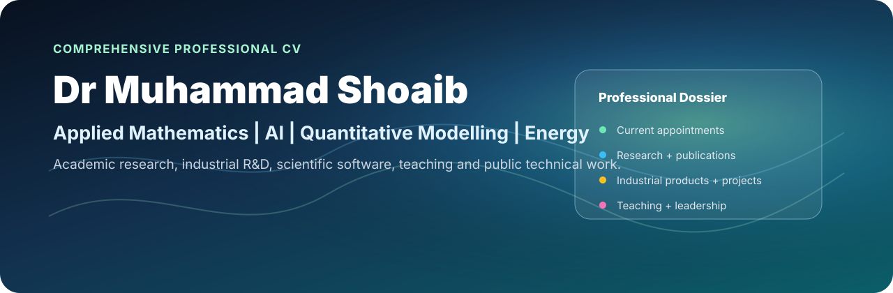

  

  
  
  
  

# Dr Muhammad Shoaib

**Applied Mathematician · Data Scientist · Research Lead · Adjunct Professor**

Motherwell, Scotland, United Kingdom · [Email](mailto:safridi@gmail.com) · [GitHub](https://github.com/drmshoaib) · [LinkedIn](https://www.linkedin.com/in/drmshoaib) · [ORCID](https://orcid.org/0000-0003-1644-1559) · [Google Scholar](https://scholar.google.com/citations?user=VCSUWUEAAAAJ)

This page is my **complete public professional CV**. It is intended to be read directly here on GitHub; the [PDF version](Dr_Muhammad_Shoaib_Comprehensive_CV.pdf) is retained for applications, formal circulation and printing.

## Contents

[Professional profile](#professional-profile) · [Current appointments](#current-appointments) · [Industrial R&D at Utopi](#industrial-research-and-product-development--utopi-ltd) · [Public projects](#selected-public-research-and-software-projects) · [Research interests](#research-interests) · [Education](#education) · [Previous appointments](#previous-academic-appointments) · [Patent](#patent-and-intellectual-property) · [Manuscripts](#current-manuscripts) · [Publications](#peer-reviewed-journal-publications) · [Conferences](#conference-proceedings-and-presentations) · [Supervision](#postgraduate-supervision) · [Teaching](#teaching-and-curriculum-leadership) · [Funding & awards](#selected-research-funding-and-awards) · [Leadership & service](#academic-leadership-and-service) · [Technical competencies](#technical-competencies) · [Links](#public-professional-links)

---

## Professional Profile

Applied mathematician and data scientist with more than twenty years of university teaching, research and academic leadership experience across the UK, Middle East and Southeast Asia, together with current industrial work in AI, energy analytics and decision systems.

My research spans celestial mechanics and dynamical systems, spacecraft attitude dynamics, numerical analysis, stochastic modelling, optimisation and scientific computing. Current work combines mathematical modelling, statistical inference, machine learning and reproducible software for building-energy, renewable-energy, quantitative-research and operational decision problems.

## Current Appointments

### Senior Data Scientist / Research Lead (Applied Mathematics & AI) — [Utopi Ltd](https://www.utopi.co.uk/)
**Glasgow, UK · 2025–Present**

- Lead applied mathematics, statistical modelling and AI research for building-energy and environmental analytics using high-frequency IoT telemetry.
- Develop mathematical models from research formulation through validation, software implementation and deployment as decision-support products.
- Work across research, engineering and product teams to translate mathematical methods into operational analytical services.

### Adjunct Professor, Centre of Data Science — [Government College University Faisalabad](https://gcuf.edu.pk/faculties/physical-science/data-science/)
**Faisalabad, Pakistan · 2026–Present**

- Teach the final-year BS Data Science/Analytics course *Applied Industrial Data Science — From Models to Market*.
- Designed a 16-week lecture-and-laboratory programme covering applied modelling, reproducible computation, testing, productionisation, MLOps and decision systems.
- Use project-based assessment and GitHub-based workflows to connect mathematical and statistical methods to industrial practice.

### Director, Research & Development — [Smart and Scientific Solutions Ltd / SSS Techs](https://www.ssstechs.com/)
**Hamilton, Scotland, UK · 2020–Present**

- Lead independent applied-mathematics, quantitative-modelling and analytical-software R&D.
- Develop public research software and prototypes spanning renewable-energy decision support, quantitative research, scientific computing, mathematical finance and model assurance.

---

## Industrial Research and Product Development — Utopi Ltd

The descriptions below are deliberately suitable for a public CV. They explain the mathematical and technical work without publishing client data, internal thresholds, proprietary calibration choices or implementation details.

### Energy Benchmarking and Technical Efficiency

Developed weather-normalised energy benchmarking methods combining **change-point regression**, **stochastic frontier analysis (SFA)** and efficiency estimation. Built quality-control logic and reporting outputs for portfolio comparison, identification of avoidable consumption and operational decision-making. The work includes daily and monthly benchmarking approaches and the translation of model outputs into interpretable building-performance measures.

### Mould-Risk Analytics

Implemented an hourly mould-risk model based on published **Ojanen/VTT** methodology. The model uses indoor environmental telemetry to estimate conditions associated with surface mould development and supports earlier, targeted operational intervention.

### Legionella Proxy Risk

Developed a risk-prioritisation model that combines occupancy/stagnation evidence with thermal behaviour to identify locations that warrant attention. The model is designed to support targeted operational checks while avoiding disclosure of site-specific rules or internal decision thresholds.

### Heat-Loss Estimation

Developed inverse cooling-event models that estimate relative heat-loss behaviour from passive temperature decay. The method identifies suitable cooling periods, fits thermal-decay models and applies model-quality checks before interpretation.

### Anomalous Heating / Rogue-Heater Detection

Developed statistical models for detecting indoor-temperature behaviour that is inconsistent with expected outdoor conditions, prior indoor state and occupancy evidence. The work supports investigation of portable or unmanaged heating and other atypical thermal behaviour.

### Unoccupied-Heating Analytics

Developed portfolio analytics that identify persistent heating where occupancy evidence is low, helping operational teams distinguish likely occupancy-driven demand from potentially avoidable heating.

### Utopi Index / Building Energy Performance Score

Developed and productionised a multi-signal building-performance scoring framework that converts telemetry-derived indicators into a concise operational index. Implemented the analytical logic as a deployable cloud service with validation and model-QA workflows.

---

## Selected Public Research and Software Projects

<table>
  <tr>
    <td width="50%" valign="top">
      <h3>WattVector</h3>
      
<strong>Renewable-energy decision intelligence.</strong>

      
Probabilistic forecasting, calibrated uncertainty, scenario analysis and risk-aware dispatch comparison for renewable-energy operations.

      
<a href="https://wattvector.streamlit.app/"><strong>Launch application</strong></a>

    </td>
    <td width="50%" valign="top">
      <h3>Quant Research Lab</h3>
      
Cross-sectional ETF research with next-open execution, purged expanding-window validation, HAC/Newey-West inference, placebo testing, multiple-testing control, turnover accounting and a sealed final hold-out.

      
<a href="https://github.com/drmshoaib/quant-research-lab"><strong>Open repository</strong></a>

    </td>
  </tr>
  <tr>
    <td width="50%" valign="top">
      <h3>Latent Performance Benchmarking</h3>
      
Factor-adjusted benchmarking with full cross-portfolio HAC inference, empirical-Bayes shrinkage, bootstrap rank uncertainty and forward validation.

      
<a href="https://github.com/drmshoaib/latent-performance-benchmarking"><strong>Open repository</strong></a>

    </td>
    <td width="50%" valign="top">
      <h3>Heston Model Calibration</h3>
      
Stochastic-volatility pricing and numerical calibration using Fourier methods, implied-volatility inversion, constrained optimisation and model diagnostics.

      
<a href="https://github.com/drmshoaib/heston-model-calibration"><strong>Open repository</strong></a>

    </td>
  </tr>
  <tr>
    <td width="50%" valign="top">
      <h3>OceanWatchAI</h3>
      
C++20 AIS trajectory analysis with explainable risk scoring, geospatial outputs, FastAPI services and analyst-facing interfaces.

      
<a href="https://github.com/drmshoaib/OceanWatch"><strong>Open repository</strong></a>

    </td>
    <td width="50%" valign="top">
      <h3>What's Under the Hood?</h3>
      
Public lecture series on the mathematics, optimisation and numerical methods behind machine-learning algorithms.

      
<a href="https://drmshoaib.github.io/whats-under-the-hood/"><strong>Read the lecture series</strong></a> · <a href="https://github.com/drmshoaib/whats-under-the-hood"><strong>Repository</strong></a>

    </td>
  </tr>
</table>

### RA15 Four-Body

Modernised high-order numerical integration for celestial-mechanics problems, connecting my earlier applied-mathematics research with current scientific-computing practice.

[Open RA15 Four-Body repository](https://github.com/drmshoaib/ra15-fourbody-modern_version)

---

## Research Interests

- Celestial mechanics, restricted multi-body problems and central configurations
- Dynamical systems, bifurcation analysis, stability and periodic-orbit computation
- Spacecraft attitude dynamics and control; Lorentz-force models
- Numerical analysis, optimisation and scientific computing
- Stochastic modelling, statistical inference and stochastic frontier analysis
- Renewable-energy systems, probabilistic forecasting, uncertainty quantification and AI-enabled grid-risk decision support
- Physics-informed and data-driven mathematical modelling for energy and engineering systems
- Quantitative finance, risk modelling and uncertainty-aware decision systems

---

## Education

### MSc Big Data Technologies, Distinction — [Glasgow Caledonian University](https://www.gcu.ac.uk/)
**2024–2025**

Data Lab Academy scholarship. Core study included Big Data Systems, Machine Learning and AI, Cloud Computing, Advanced Data Processing, Data Visualisation and Data Ethics.

### PhD Applied Mathematics — [Glasgow Caledonian University](https://www.gcu.ac.uk/)
**2001–2004**

Thesis research in mathematical modelling and stability analysis of multi-body dynamical systems. Recipient of the **Outstanding Computing and Mathematical Sciences PhD Student Award**.

### MPhil Applied Mathematics — [Quaid-i-Azam University](https://qau.edu.pk/)
**1997–1999 · Islamabad, Pakistan**

### MSc Applied Mathematics — [Quaid-i-Azam University](https://qau.edu.pk/)
**1995–1997 · Islamabad, Pakistan**

### BSc Mathematics and Computer Science — [University of Peshawar](https://www.uop.edu.pk/)
**1992–1994 · Pakistan**

---

## Previous Academic Appointments

### Assistant Professor, Mathematics — [Higher Colleges of Technology](https://hct.ac.ae/)
**Al-Ain, UAE · 2015–2020**

- Taught applied mathematics across engineering and technology programmes and contributed to research and curriculum development.
- Team Leader for General Studies, covering Mathematics, Physics, IT and Humanities.
- Member of the Accreditation Committee and Applied Research Council.
- Chaired the Textbook Review Committee and an ad hoc workload committee.

### Assistant Professor, Mathematics — University of Ha'il
**Ha'il, Saudi Arabia · 2008–2015**

- Taught applied mathematics to mathematics, science and engineering cohorts.
- Maintained an active research programme in celestial mechanics, numerical analysis and computational mathematics.
- Module Leader for Numerical Analysis, Engineering Mathematics, Calculus I–III and Differential Equations.
- Member of the Science and Technology Unit and College of Sciences curriculum development committee.

### Director, Preparatory Year Programme — Mathematics — University of Ha'il
**Ha'il, Saudi Arabia · 2008–2010**

- Led mathematics curriculum development, staff development and performance monitoring, timetabling and workload allocation.
- Coordinated curriculum relevance with Computer Science, Engineering and Management Information Systems departments.

### Senior Lecturer, Mathematics — [Universiti Teknologi PETRONAS](https://www.utp.edu.my/)
**Tronoh, Malaysia · 2007–2008**

Taught engineering mathematics and coordinated Engineering Mathematics provision.

### Lecturer, part time — [Glasgow Caledonian University](https://www.gcu.ac.uk/)
**Glasgow, UK · 2006–2007**

### Postdoctoral Research Fellow — [National University of Sciences and Technology (NUST)](https://nust.edu.pk/)
**Rawalpindi, Pakistan · 2004–2005**

### Graduate Teaching Assistant — [Glasgow Caledonian University](https://www.gcu.ac.uk/)
**Glasgow, UK · 2001–2004**

### Lecturer — Institute of Business Administration and Technology
**Islamabad, Pakistan · 1998–2001**

---

## Patent and Intellectual Property

- **UK Patent Application GB2307251.5**, filed 16 May 2023. *Methodology of diagnosing depression using (EEG) electroencephalographic measurements.* Patent application arising from research on EEG-based methods for diagnosis of Major Depressive Disorder.

---

## Current Manuscripts

### Submitted manuscripts

1. **M. Shoaib** (2026). “Roll Equilibria of a Lorentz-Driven Spacecraft in Low Earth Orbit.” Submitted to *Acta Astronautica*.
2. **M. Shoaib** and A. R. Kashif (2026). “Equilibrium Bifurcations and Periodic Dynamics in a Planar Restricted Five-Body Problem with Four Unequal Primaries.” Submitted to *Dynamical Systems*.
3. **M. Shoaib**, B. Benhammouda, B. A. Steves and W. L. Sweatman (2026). “Central configurations in the general four body coplanar problem with different masses.” Submitted to *Celestial Mechanics and Dynamical Astronomy*. [Research Square preprint](https://doi.org/10.21203/rs.3.rs-2783132/v1); presented at the IAU General Assembly 2024.

---

## Peer-Reviewed Journal Publications

1. A. Mansur, **M. Shoaib**, I. Szucs-Csillik, D. Offin, J. Brimberg and H. Fgaier (2024). “Periodic and Quasi-Periodic Orbits in the Collinear Four-Body Problem: A Variational Analysis.” *Mathematics*, 12(19), 3152. [doi:10.3390/math12193152](https://doi.org/10.3390/math12193152).
2. A. R. Kashif and **M. Shoaib** (2023). “Restricted Concave Kite Five-Body Problem.” *Advances in Astronomy*, 2023, Article 9434141. [doi:10.1155/2023/9434141](https://doi.org/10.1155/2023/9434141).
3. M. A. R. Siddique, A. R. Kashif, **M. Shoaib** and S. Hussain (2021). “Stability Analysis of the Rhomboidal Restricted Six-Body Problem.” *Advances in Astronomy*, 2021, Article 5575826. [doi:10.1155/2021/5575826](https://doi.org/10.1155/2021/5575826).
4. S. Alhowaity and **M. Shoaib** (2019). “Relative equilibria in curved restricted 4- and 5-body problems.” *Journal of Physics: Conference Series*, 1366, 012006, 1–11.
5. **M. Shoaib**, A. R. Kashif and I. Szucs-Csillik (2017). “On the planar central configurations of rhomboidal and triangular four- and five-body problems.” *Astrophysics and Space Science*, 362(10), 182.
6. A. Qayyum, **M. Shoaib** and I. Faye (2017). “On new refinements and applications of efficient quadrature rules using n-times differentiable mappings.” *Journal of Computational Analysis and Applications*, 23(4), 723–739.
7. M. M. Al-Sawalha, M. Ghazal, O. Y. Ababneh and **M. Shoaib** (2017). “Adaptive add order synchronization and anti-synchronization of fractional order chaotic systems with fully unknown parameters.” *Journal of Nonlinear Science and Applications*, 10(4), 2592–2606.
8. **M. Shoaib**, A. R. Kashif and A. Sivasankaran (2016). “Planar Central Configurations of symmetric five-body problems with two pairs of equal masses.” *Advances in Astronomy*, 2016, Article 9897681. [doi:10.1155/2016/9897681](https://doi.org/10.1155/2016/9897681).
9. M. M. Al-Sawalha and **M. Shoaib** (2016). “Reduced-order synchronization of fractional order chaotic systems with fully unknown parameters using modified adaptive control.” *Journal of Nonlinear Science and Applications*, 9(4), 1815–1825.
10. A. Qayyum, **M. Shoaib** and I. Faye (2016). “A companion of Ostrowski type integral inequality using a 5-step kernel with some applications.” *Filomat*, 30(13), 3601–3614.
11. A. Qayyum, A. R. Kashif, **M. Shoaib** and I. Faye (2016). “Derivation of new efficient quadrature rules using Ostrowski type integral inequalities for n-times differentiable mappings.” *Journal of Inequalities and Special Functions*, 7(3), 48–72.
12. A. Qayyum, A. R. Kashif, **M. Shoaib** and I. Faye (2016). “Derivation and applications of inequalities of Ostrowski type for n-times differentiable mappings for cumulative distribution function and some quadrature rules.” *Journal of Nonlinear Science and Applications*, 9(4), 1844–1857.
13. A. R. Kashif, **M. Shoaib** and M. A. Latif (2016). “Improved version of perturbed Ostrowski type inequalities for n-times differentiable mappings with three-step kernel and its application.” *Journal of Nonlinear Science and Applications*, 9(4), 3319–3332.
14. M. M. Al-Sawalha and **M. Shoaib** (2016). “Adaptive modified synchronization of hyper-chaotic systems with fully unknown parameters.” *International Journal of Dynamics and Control*, 4(1), 23–30.
15. A. Qayyum, I. Faye and **M. Shoaib** (2016). “Improvement of Ostrowski Integral Type inequalities with application.” *Filomat*, 30(6), 1441–1456.
16. A. Qayyum, **M. Shoaib** and I. Faye (2016). “A Companion of Ostrowski-Type Inequality based on 5-step quadratic kernel and Applications.” *Journal of Nonlinear Science and Applications*, 9(2), 537–552.
17. A. R. Kashif, **M. Shoaib** and M. A. Latif (2016). “Applications and derivation of Ostrowski type inequalities for n-times differentiable functions for some efficient quadrature rules.” *Science International*, 28(3), 2283–2290.
18. **M. Shoaib** (2015). “Regions of Central Configurations in a Symmetric 4+1-Body Problem.” *Advances in Astronomy*, 2015, Article 649352. [doi:10.1155/2015/649352](https://doi.org/10.1155/2015/649352).
19. **M. Shoaib** (2015). “Corrigendum to Regions of Central Configurations in a Symmetric 4+1-Body Problem.” *Advances in Astronomy*, 2015, Article 284189.
20. **M. Shoaib** (2015). “Central Configurations in the Trapezoidal Four-Body Problems.” *Applied Mathematical Sciences*, 9(40), 1971–1979.
21. Y. Abdel-Aziz and **M. Shoaib** (2015). “Periodic solutions for rotational motion of an axially symmetric charged satellite.” *Applied Mathematical Sciences*, 9(32), 1551–1563.
22. A. Qayyum, I. Faye and **M. Shoaib** (2015). “On New Generalized Inequalities Via Riemann-Liouville Fractional Integration.” *Journal of Fractional Calculus and Applications*, 6(1), 91–105.
23. A. Qayyum, **M. Shoaib** and I. Faye (2015). “Some New Generalized Results on Ostrowski Type Integral Inequalities With Application.” *Journal of Computational Analysis and Applications*, 19(4), 693–712.
24. A. Qayyum, **M. Shoaib** and I. Faye (2015). “On New Weighted Ostrowski Type inequalities Involving Integral Means Over End Intervals and Application.” *Turkish Journal of Analysis and Number Theory*, 3(2), 61–67.
25. Y. Abdel-Aziz and **M. Shoaib** (2015). “Attitude stabilization of a charged spacecraft subject to Lorentz force.” *Advances in the Astronautical Sciences*, 153, 399–412.
26. M. Amer and **M. Shoaib** (2015). “Hermite-Hadamard type integral inequalities for differentiable m-pre-invex and (alpha,m)-pre-invex functions.” *Journal of the Egyptian Mathematical Society*, 23(2), 236–241.
27. Y. Abdel-Aziz and **M. Shoaib** (2015). “Attitude dynamics and control of spacecraft using geomagnetic Lorentz force.” *Research in Astronomy and Astrophysics*, 15(1), 127–144.
28. A. Qayyum, I. Faye, **M. Shoaib** and M. A. Latif (2015). “A generalization of Ostrowski type inequality for mappings whose second derivatives belong to L1(a,b) and applications.” *International Journal of Pure and Applied Mathematics*, 98(2), 169–180.
29. Y. Abdel-Aziz and **M. Shoaib** (2014). “Equilibria of a charged artificial satellite subject to gravitational and Lorentz torques.” *Research in Astronomy and Astrophysics*, 14(7), 891–902.
30. **M. Shoaib**, A. Sivasankaran and A. R. Kashif (2014). “Central configurations in the collinear five-body problem.” *Turkish Journal of Mathematics*, 38(3), 576–585.
31. A. Qayyum, **M. Shoaib**, A. E. Matouk and M. A. Latif (2014). “On new generalized Ostrowski type inequalities.” *Abstract and Applied Analysis*, 2014, 1–8.
32. A. Qayyum, **M. Shoaib** and M. A. Latif (2014). “Generalized Inequality of Ostrowski Type for Twice Differentiable Bounded Mappings and Applications.” *Applied Mathematical Sciences*, 8(38), 1889–1901.
33. Y. Abdel-Aziz and **M. Shoaib** (2014). “Numerical analysis of the attitude stability of a charged spacecraft in Pitch-Roll-Yaw directions.” *International Journal of Aeronautical and Space Sciences*, 15(1), 82–90.
34. **M. Shoaib**, A. Sivasankaran and Y. Abdel-Aziz (2014). “Central Configurations in a symmetric five-body problem.” *Chaotic Modeling and Simulation*, 3(3), 431–439.
35. A. Sivasankaran and **M. Shoaib** (2014). “An efficient computational approach for global regularization schemes.” *Chaotic Modeling and Simulation*, 3(3), 441–450.
36. A. Basit and **M. Shoaib** (2014). “A Human Ear Recognition method using Nonlinear Curvelet Feature Subspace.” *International Journal of Computer Mathematics*, 91(3), 616–624.
37. **M. Shoaib**, R. Hussain and A. Dar (2013). “Automated Segmentation of lungs in Computed Tomographic Images.” *European Journal of Scientific Research*, 98(1), 45–54.
38. **M. Shoaib** and I. Faye (2011). “Collinear equilibrium solutions of four-body problem.” *Journal of Astrophysics and Astronomy*, 32, 411–423.
39. **M. Shoaib**, B. A. Steves and A. Szell (2008). “Stability analysis of quintuple stellar and planetary systems using a symmetric five body model.” *New Astronomy*, 13, 639–645.
40. A. Qadir, M. Sharif and **M. Shoaib** (2000). “The Momentum four-vector in the e-psi-N formalism and the Angular momentum imparted to test particles by gravitational waves.” *Il Nuovo Cimento B*, 115, 419–425.

---

## Conference Proceedings and Presentations

1. B. Steves, **M. Shoaib** and W. Sweatman (2017). “Analytical stability criteria for the Caledonian Symmetric Four and Five Body Problems.” AAS/Division of Dynamical Astronomy Meeting, Vol. 48.
2. **M. Shoaib**, I. Faye and A. Basit (2016). “Multi-resolution Analysis for Ear Recognition using Wavelet Features.” *AIP Conference Proceedings*, 1787, 080011.
3. A. Qayyum, **M. Shoaib**, I. Faye and A. R. Kashif (2016). “Refinements of Some New Efficient Quadrature Rules.” *AIP Conference Proceedings*, 1787, 080003.
4. **M. Shoaib**, A. Sivasankaran and A. R. Kashif (2014). “Central configurations of an isosceles trapezoidal five-body problem.” Conference on Hamiltonian Systems and Celestial Mechanics (HAMSYS2014), CRM, Barcelona, Spain.
5. A. Sivasankaran and **M. Shoaib** (2013). “An efficient computational approach for global regularization schemes.” 6th Chaotic Modeling and Simulation International Conference, Istanbul, Turkey.
6. Y. Abdel-Aziz and **M. Shoaib** (2014). “Relative dynamics and control of spacecraft formations subject to Lorentz force perturbations.” 40th COSPAR Scientific Assembly.
7. A. Sivasankaran, B. A. Steves, W. L. Sweatman and **M. Shoaib** (2012). “An empirical stability analysis of the Caledonian Symmetric Four-Body model.” New Trends in Dynamical Systems, Salou, Spain.
8. **M. Shoaib**, A. Sivasankaran and I. Faye (2012). “Some Special Solutions of the Rhomboidal Five-Body Problem.” *AIP Conference Proceedings*, 1482, 496.
9. M. Assefa, I. Faye, A. S. Malik and **M. Shoaib** (2013). “Lung Nodule Detection Using Multi-Resolution Analysis.” 2013 ICME International Conference on Complex Medical Engineering, Beijing, China.
10. M. Usman, **M. Shoaib** and M. Rahal (2013). “Multi-resolution Analysis Technique for Lung Cancer Detection in Computed Tomographic Images.” 34th PIERS, Stockholm, Sweden, 1684–1689.

---

## Postgraduate Supervision

- **Completed PhD supervision:** Dr Ather Qayyum, *Integral Inequalities with Applications to Numerical Quadrature Rules*.
- Supervised undergraduate research projects and postgraduate dissertations in applied mathematics, numerical methods and computational modelling.

---

## Teaching and Curriculum Leadership

- **Applied Industrial Data Science — From Models to Market**, GCUF: designed and teach a final-year 16-week lecture-and-laboratory course covering applied modelling, reproducible computation, testing, productionisation, MLOps and decision systems.
- **Calculus I — Module Leader:** approximately 500 students and 18 lecturers, University of Ha'il, 2009.
- **Calculus II — Module Leader:** approximately 550 students and 11 lecturers, University of Ha'il, 2015.
- **Calculus III — Module Leader:** approximately 227 students and 7 lecturers.
- **Numerical Analysis — Module Leader:** developed the course for mathematics students.
- **Engineering Mathematics — Module Leader.**
- Also taught Differential Equations, Linear Algebra and Methods of Applied Mathematics.
- Extensive teaching across engineering, mathematics, technology and multidisciplinary cohorts in the UK, Saudi Arabia, UAE, Malaysia and Pakistan.

---

## Selected Research Funding and Awards

- **Outstanding Computing and Mathematical Sciences PhD Student Award**, Glasgow Caledonian University.
- **University of Ha'il research funding:** SAR 96,000 (2014) and SAR 108,000 (2012).
- **British Council Collaborative Research Grant:** Co-Investigator, GBP 8,000 (2002–2003).
- **Glasgow Caledonian University PhD Studentship:** GBP 46,800 (2001–2004).
- **Universiti Teknologi PETRONAS research support:** MYR 12,000 (2007).
- **NATO Advanced Study Institute — *Chaotic Worlds: From Order to Disorder in Gravitational N-Body Dynamical Systems*:** Organising Committee; programme grant EUR 50,000 (2003).
- Collaborative research visits supported by Glasgow Caledonian University, including Eötvös University, Budapest.

---

## Academic Leadership and Service

- Member, **Applied Research Council**, Higher Colleges of Technology; research policy and grant management across HCT colleges.
- Member, **Accreditation Committee**, Higher Colleges of Technology; contributed to initial CAA accreditation and self-study preparation.
- **Team Leader, General Studies**, Higher Colleges of Technology — Mathematics, Physics, IT and Humanities.
- Member, **Science and Technology Unit**, University of Ha'il; one of ten members selected from a faculty of approximately 800.
- Member, **College of Sciences Curriculum Development Committee**, University of Ha'il.
- Editorial board member, *The NUCLEUS*; referee for international applied mathematics journals.
- Organising Committee, **NATO Advanced Study Institute — *Chaotic Worlds***, Cortina d'Ampezzo, Italy (2003).
- Organising Committee, **Scottish Universities Summer School in Physics — *Extra Solar Planets: the detection, formation, evolution and dynamics of planetary systems***, Skye, Scotland (2007).

---

## International Research Collaboration

Long-standing research collaboration with colleagues at Glasgow Caledonian University, Massey University, the Romanian Academy Astronomical Institute, Universiti Teknologi PETRONAS, Khalifa University and other institutions in celestial mechanics, numerical analysis and computational modelling.

---

## Technical Competencies

| Area | Methods and tools |
| --- | --- |
| **Scientific computing** | Python — NumPy, SciPy, pandas, statsmodels, scikit-learn; MATLAB; Mathematica; Maple; R |
| **Programming** | Python, C, C++, FORTRAN, SQL |
| **Mathematical & statistical methods** | Numerical optimisation, ODE integration, bifurcation and stability analysis, stochastic modelling, probabilistic forecasting, uncertainty quantification, conformal calibration, CVaR optimisation, HAC/Newey-West inference, bootstrap methods, regression and machine learning |
| **Engineering** | FastAPI, Streamlit, React/TypeScript, Docker, GitHub Actions, automated testing, configuration-driven workflows |
| **Reproducibility** | Git/GitHub, Jupyter, unit testing, documented computational workflows, reproducible experiment protocols |
| **Teaching platforms** | Moodle, Blackboard, GitHub Classroom |
| **Languages** | English, Urdu, Pashto, Arabic, Punjabi |

---

## Public Professional Links

- [GitHub — drmshoaib](https://github.com/drmshoaib)
- [LinkedIn — Dr Muhammad Shoaib](https://www.linkedin.com/in/drmshoaib)
- [ORCID — 0000-0003-1644-1559](https://orcid.org/0000-0003-1644-1559)
- [Google Scholar](https://scholar.google.com/citations?user=VCSUWUEAAAAJ)
- [Smart and Scientific Solutions / SSS Techs](https://www.ssstechs.com/)
- [WattVector](https://wattvector.streamlit.app/)
- [What's Under the Hood?](https://drmshoaib.github.io/whats-under-the-hood/)

### PDF version

The repository page above is the primary public CV. For formal applications, printing or direct sharing:

**[Download the comprehensive PDF CV](Dr_Muhammad_Shoaib_Comprehensive_CV.pdf)**

---

**Updated October 2026**
